# ✅ UpTask - Gestor de Proyectos y Tareas

Aplicación web completa desarrollada en PHP (sin frameworks) para la gestión de tareas y proyectos. Permite a los usuarios registrarse, iniciar sesión, crear múltiples proyectos y organizar tareas de forma dinámica y visual.

---

## 📌 Características

- Registro e inicio de sesión de usuarios.
- Creación y edición de proyectos personales.
- Gestión de tareas por proyecto.
- Cambio de estado de tareas (completadas/incompletas).
- Interfaz visual interactiva con AJAX.
- Arquitectura MVC pura.
- Sistema de alertas y validaciones.

---

## 🛠️ Tecnologías utilizadas

- PHP 8+ (sin framework)
- MySQL
- HTML5, CSS3, SASS
- JavaScript (ES6) + AJAX
- Gulp
- Composer (autoloading)
- Dotenv (.env)

---

## 📁 Estructura de carpetas

proyecto-uptask/
│
├── controllers/ # Controladores de lógica
├── models/ # Modelos de la base de datos
├── views/ # Vistas HTML
├── includes/ # Conexión DB, funciones y config
│ ├── .env # Variables sensibles (no subir)
│ ├── database.php # Conexión MySQL
│ └── funciones.php # Funciones globales
├── classes/ # Clases auxiliares (Email, etc.)
├── public/ # Carpeta accesible (index.php)
├── build/ # Archivos compilados por Gulp
├── src/ # Archivos fuente (SASS, JS)
├── gulpfile.js # Configuración de Gulp
├── package.json # Dependencias frontend
├── composer.json # Dependencias PHP
└── Router.php # Enrutador personalizado

---

## 📷 Capturas de pantalla

### Login
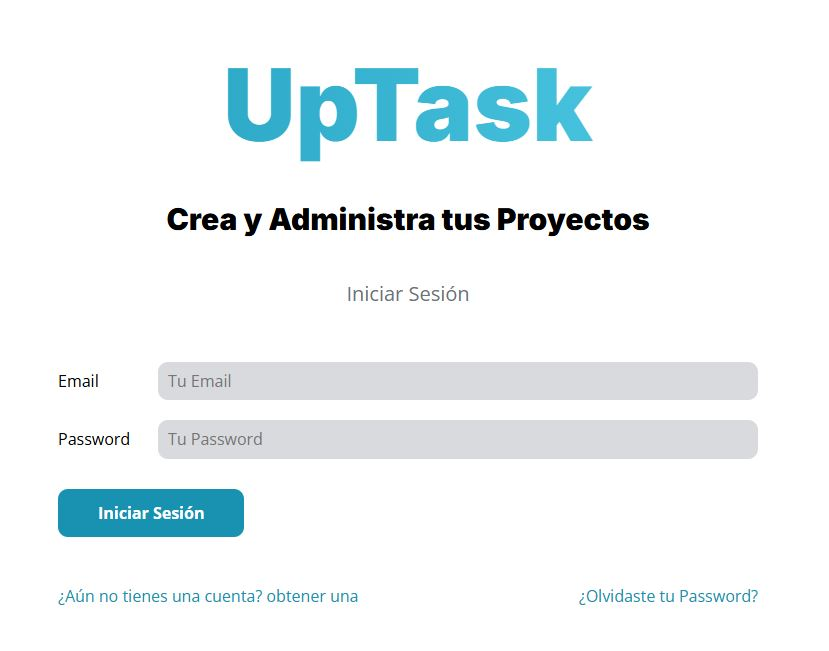

### Registrar
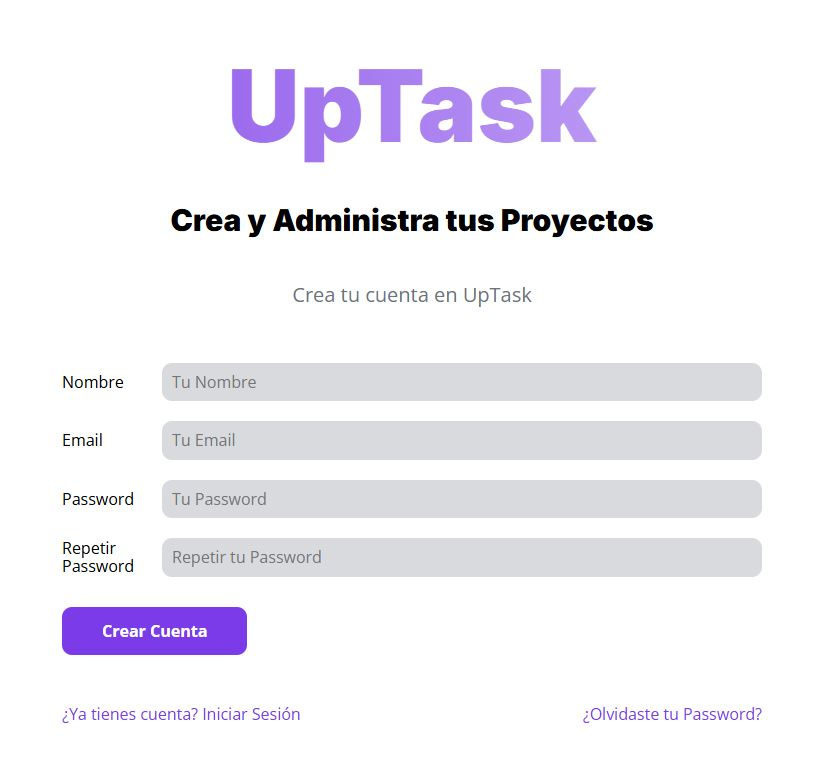

### Recuperar Password
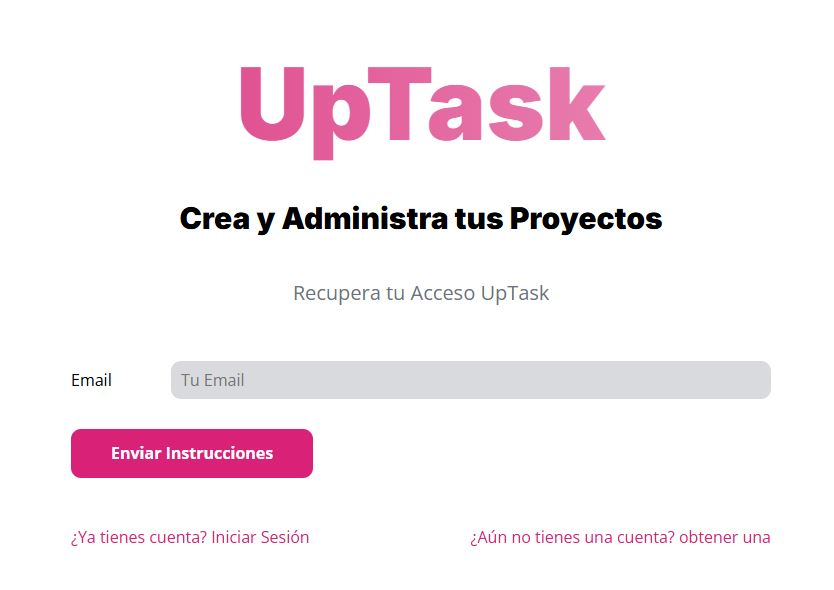

### Página de inicio
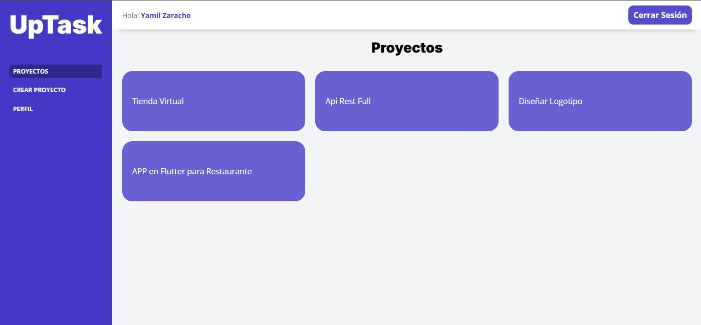

### Crear Proyecto
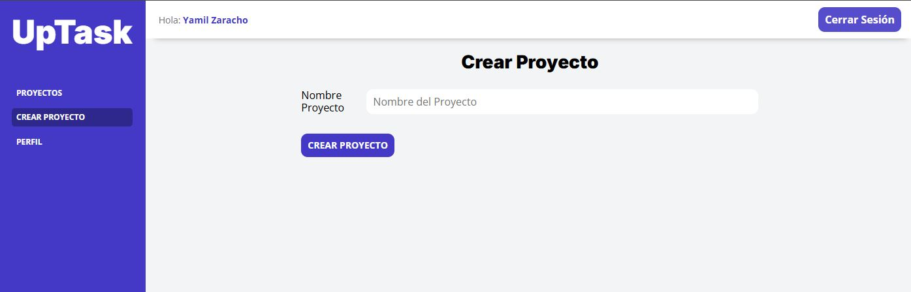

### Perfil
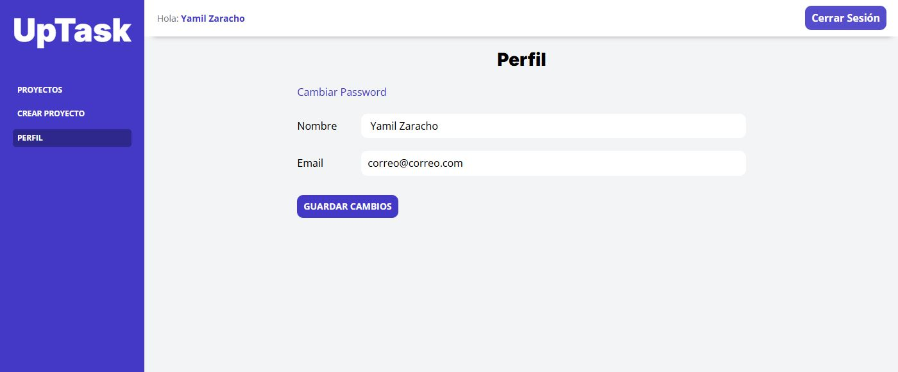

### Cambiar Password
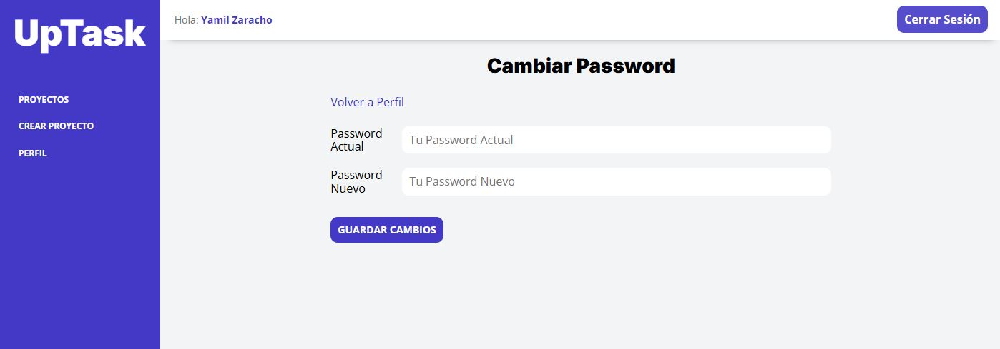

### Tareas
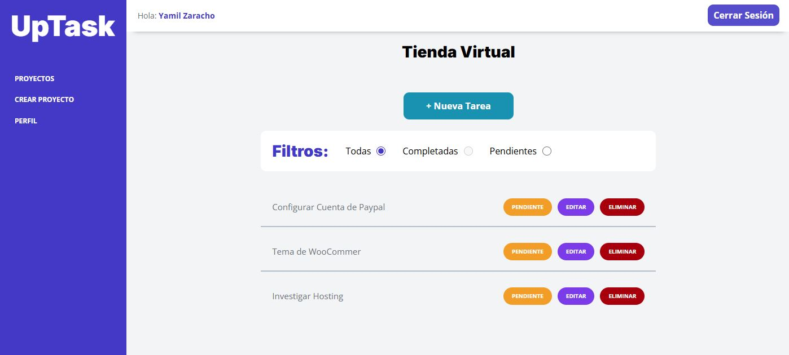

### Añadir Tareas 
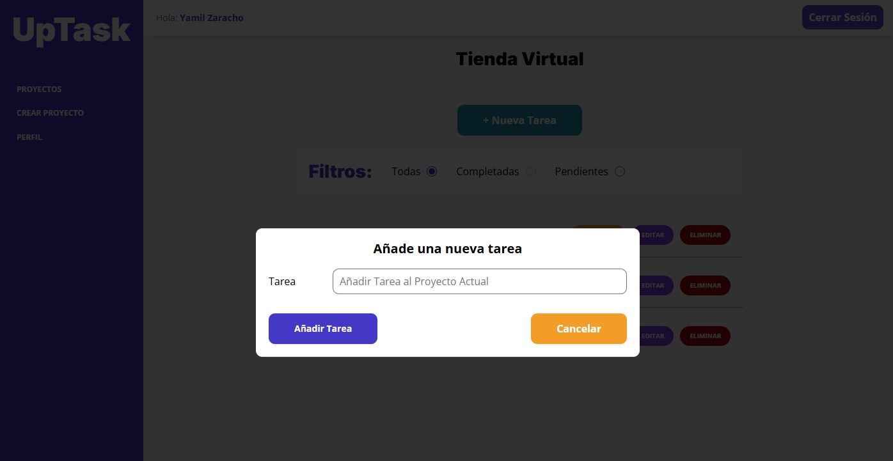

### Confirmar Email
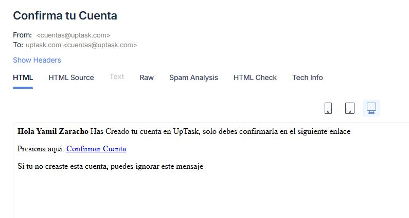

### Reestablecer Email
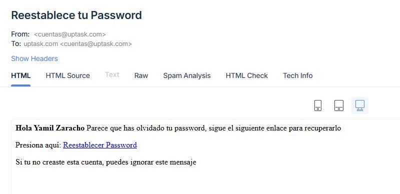

---

## 🚀 Cómo clonar y ejecutar el proyecto

# 1. Clonar el repositorio
```bash
git clone https://github.com/YamilGZ/proyecto-uptask.git
cd proyecto-uptask
```

# 2. Instalar dependencias PHP
```bash
composer install
```

# 3. Instalar dependencias frontend
```bash
npm install
```

# 4. Compilar recursos con Gulp
```bash
gulp
```

# 5. Crear base de datos y configurar .env
```bash
Crea una base de datos MySQL llamada uptask_mvc y actualiza el archivo .env:
DB_HOST=localhost
DB_USER=root
DB_PASS=tu_password
DB_NAME=uptask_mvc

cp includes/.env.example includes/.env
```

# 6. Iniciar servidor local:

```bash
php -S localhost:3000 -t public
```

---

## 👨‍💻 Autor

Desarrollado por Yamil G. Zaracho R. (YamilGZ).

---